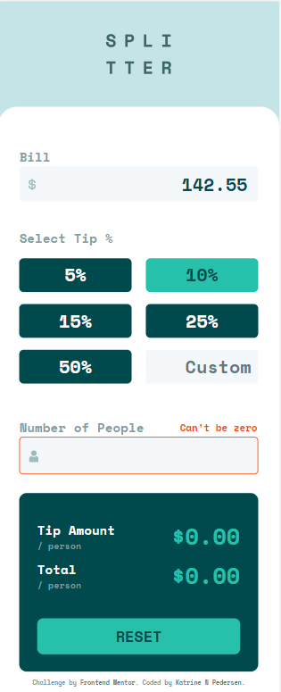
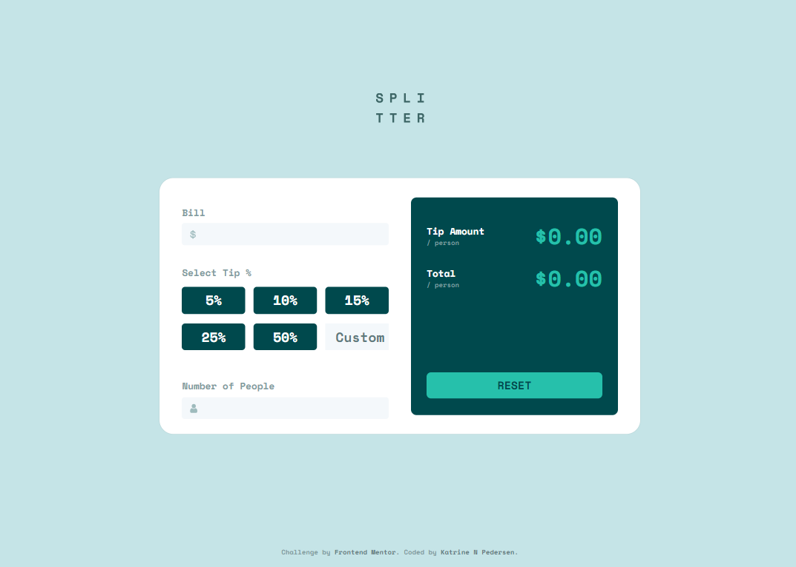

# Frontend Mentor - Tip calculator app solution

This is a solution to the [Tip calculator app challenge on Frontend Mentor](https://www.frontendmentor.io/challenges/tip-calculator-app-ugJNGbJUX). Frontend Mentor challenges help you improve your coding skills by building realistic projects.

## Table of contents

- [Overview](#overview)
  - [The challenge](#the-challenge)
  - [Screenshot](#screenshot)
  - [Links](#links)
- [My process](#my-process)
  - [Built with](#built-with)
  - [What I learned](#what-i-learned-and-continued-development)
- [Author](#author)

## Overview

### The challenge

Users should be able to:

- View the optimal layout for the app depending on their device's screen size
- See hover states for all interactive elements on the page
- Calculate the correct tip and total cost of the bill per person

### Screenshot

### Links

- Solution URL: [https://github.com/KatrineNPedersen/Tip-Calculator-App.git]
- Live Site URL: [https://katrinenpedersen.github.io/Tip-Calculator-App]

## My process

### Built with

- Semantic HTML5 markup
- Sass
- Flexbox
- CSS Grid
- Mobile-first workflow
- Javascript

### What I learned and continued development

This challenge was good practice for using input values to complete calculations and display the result in real time. I will continue to incorporate CSS grid in conjunction with flexbox in future challenges, as the blend provides the best outcome in challenges like these.

## Author

- Frontend Mentor - [@KatrineNPedersen](https://www.frontendmentor.io/profile/KatrineNPedersen)
